# Angio-DualDx


Multi-model deep learning pipeline for coronary artery segmentation and stenosis detection from X-ray angiography, with a SYNTAX-inspired severity index that combines both models' outputs into a single clinically-motivated score.

A two-model framework operating on the **ARCADE** dataset (MICCAI 2023 challenge). Instead of one shared network struggling with two very different pixel distributions, this project uses two independently specialized models:

- **Vessel Segmentation**: 25 anatomical coronary segments (SYNTAX nomenclature)
- **Stenosis Detection**: instance segmentation of coronary narrowing regions

---

# Architecture

<p align="center">
  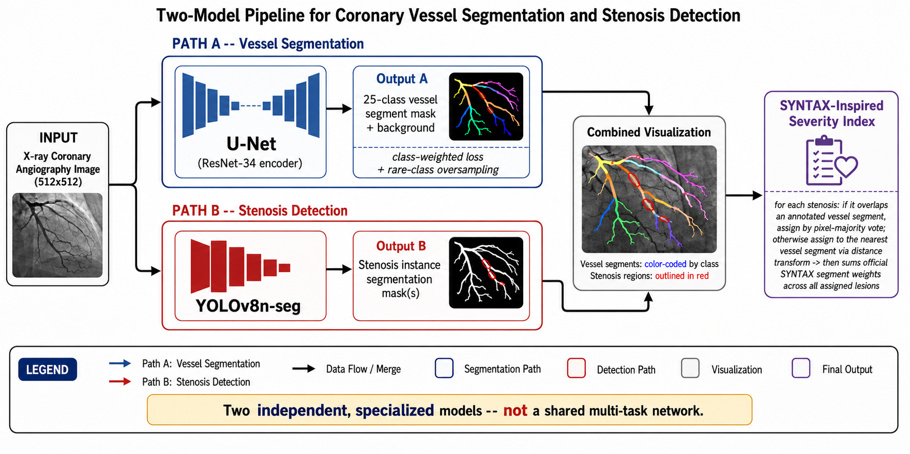
</p>

<p align="center">
  <em>High-level pipeline: two independent, specialized models converge only at the post-processing / severity-index stage -- there is no shared encoder.</em>
</p>

<details>
<summary><strong>Detailed architecture (layer-level, click to expand)</strong></summary>
<p align="center">
  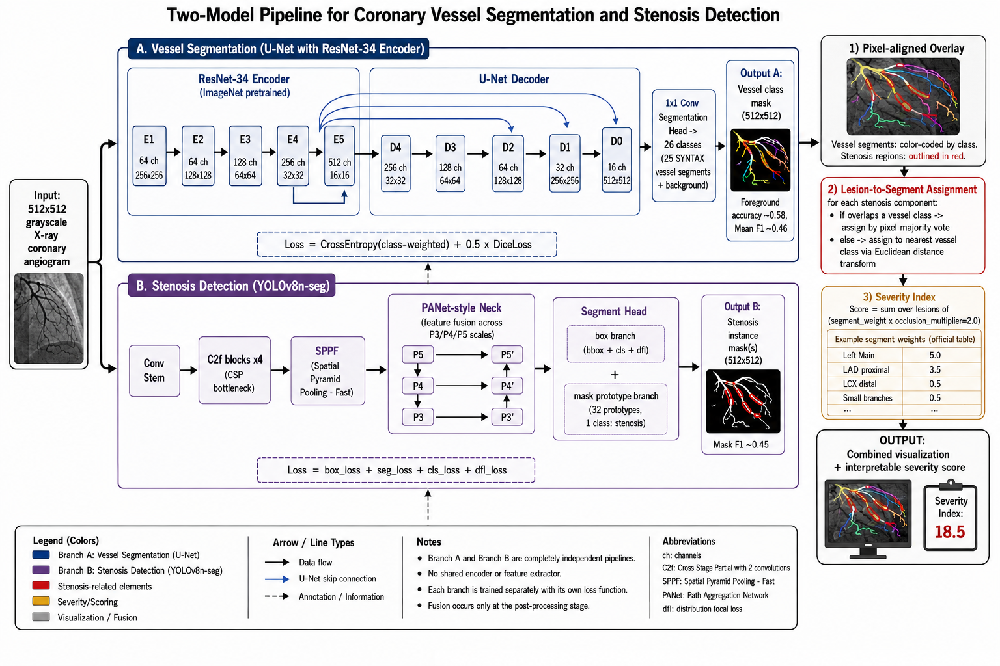
</p>
<p align="center">
  <em>Full encoder/decoder channel progression, YOLOv8n-seg internal blocks, exact loss formulas, and the SYNTAX segment-weight lookup table.</em>
</p>
</details>

---

# Overview

<p align="center">
  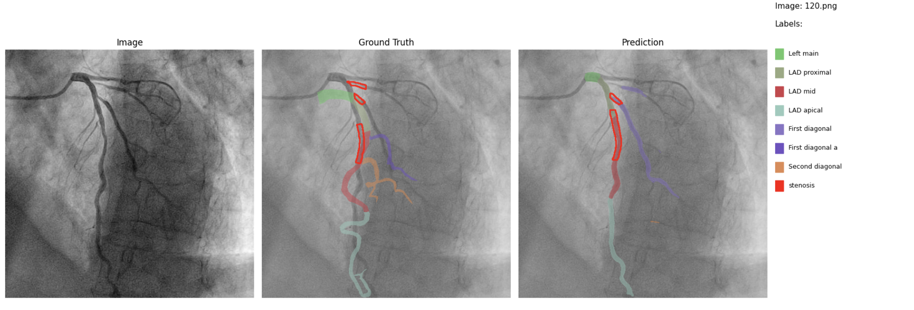
</p>

<p align="center">
  <em>Ground truth vs. prediction for both tasks on a single angiogram: vessel segments (colored, fixed per-class palette) and stenosis regions (red contour), with a shared legend.</em>
</p>

Angio-DualDx takes a single coronary X-ray angiography image and produces two aligned predictions: which anatomical segment each visible artery belongs to, and where any stenotic (narrowed) regions are located. The two predictions are then combined into a lightweight, SYNTAX-inspired severity index.

A single shared-encoder multi-task network was tried first and abandoned — see [Architecture decisions](#architecture-decisions) for the full reasoning, evidence, and why two specialized models outperform it.

<p align="center">
  
</p>

<p align="center">
  <em>Pipeline overview: two independent, specialized models (not a shared multi-task network), fused only at the post-processing stage.</em>
</p>

<details>
<summary><b>Expand for a layer-level architecture diagram</b> (encoder/decoder channel dimensions, YOLO backbone blocks, loss formulas)</summary>
<br>
<p align="center">
  
</p>
</details>

---

# Key Features

- 25-class coronary vessel segmentation (U-Net, ResNet-34 encoder)
- Class-weighted loss + rare-class oversampling for severely imbalanced segment classes
- Stenosis instance segmentation (YOLOv8n-seg), framed as detection rather than dense classification to avoid extreme pixel imbalance
- Fixed, stable per-class color palette across every figure (a segment is always the same color)
- Combined inference pipeline producing aligned vessel + stenosis predictions from one image
- SYNTAX-inspired severity index combining both models' outputs into one interpretable score
- Full evaluation suite: per-class Dice / Precision / Recall / F1 / IoU + confusion matrix
- Direct, sourced comparison against the official ARCADE (MICCAI 2023) challenge leaderboard
- Clean modular PyTorch project structure

---

# Dataset

This project uses the publicly available **ARCADE** dataset (Automatic Region-based Coronary Artery Disease diagnostics using x-ray angiography imagEs), released for the **MICCAI 2023 challenge**.

Official dataset: **[ARCADE (Zenodo)](https://zenodo.org/records/10390295)**

The dataset provides two independent COCO-format annotation sets on the same 1000 training / 200 validation angiography images:

- **`syntax`** — 25-class vessel segment segmentation + background
- **`stenosis`** — binary stenosis instance segmentation

> Dataset ownership, licensing, and citation requirements remain with the original ARCADE / MICCAI 2023 challenge authors. See [`data/README.md`](data/README.md) for download instructions and dataset-specific findings uncovered during this project (including a `category_id` vs. segment-name mismatch in the official annotations).

---

# Why Two Independent Models?

Coronary vessels and stenosis lesions have fundamentally different pixel statistics in these images: vessels are large, contiguous, well-annotated structures, while a stenosis lesion covers roughly **0.4% of an image on average**.

A single shared-encoder network with two decoder heads was tried first. Under every loss-balancing scheme attempted for the stenosis head (`pos_weight` in `{10, 15, 30, 250}`, focal loss), the model either predicted nothing or produced extreme false-positive rates. Root-cause analysis also found that **~48% of stenosis instances fall outside the bounding box of any annotated vessel** in the same image — independently ruling out crop-around-vessel localization as a fix.

Compared with a shared multi-task network, the two-model framework:

- lets each task use the loss formulation best suited to its own pixel statistics
- sidesteps the stenosis pixel-imbalance problem entirely by framing it as instance detection, not dense classification
- matches the design of top-performing methods on the official ARCADE leaderboard, where detection-style approaches (YOLO-based, Mask R-CNN, DETR variants) dominate for exactly this reason

---

# Project Structure

```text
Angio-DualDx
│
├── assets/            README figures and visualizations
│   └── results/
│       ├── vessel_segmentation/
│       ├── stenosis_detection/
│       ├── comparisons/
│       ├── visualizations/
│       └── severity_index/
│
├── configs/           Configuration files
│   └── config.py
│
├── data/              Dataset loading, COCO utilities, mask rasterization
│   ├── README.md
│   ├── coco_utils.py
│   └── dataset.py
│
├── models/            Network builders, loss functions, checkpoint I/O
│   ├── vessel_unet.py
│   ├── stenosis_yolo.py
│   └── checkpoints/    (not committed — see README there)
│
├── src/               Training, evaluation, pipeline and visualization
│   ├── train_vessel.py
│   ├── train_stenosis.py
│   ├── eval.py
│   ├── pipeline.py
│   ├── visualize.py
│   └── severity_index.py
│
├── main.py            CLI entry point (train-vessel / train-stenosis / eval / demo)
├── requirements.txt
├── LICENSE
└── README.md
```

The repository follows a modular and scalable structure, making it easy to extend with new datasets, backbone architectures, evaluation metrics, and visualization methods.

---

# Model Architecture

## Vessel Segmentation

A U-Net with a **ResNet-34** encoder (ImageNet-pretrained), predicting one of 26 classes per pixel (background + 25 SYNTAX segments).

| Parameter | Value |
|-----------|------:|
| Input size | 512 x 512 (grayscale) |
| Encoder | ResNet-34 (ImageNet) |
| Batch Size | 8 |
| Optimizer | AdamW |
| Learning Rate | 2e-4 |
| Weight Decay | 1e-4 |
| Max Epochs | 45 |
| Early Stopping | 8 epochs |
| Random Seed | 42 |

**Loss:** class-weighted CrossEntropy (inverse-log-frequency weights) + Dice loss, plus a `WeightedRandomSampler` that oversamples training images containing rare vessel classes (fewer than 100 annotations).

## Stenosis Detection

**YOLOv8n-seg**, fine-tuned as single-class instance segmentation.

| Parameter | Value |
|-----------|------:|
| Base weights | yolov8n-seg.pt |
| Input size | 512 x 512 |
| Batch Size | 8 |
| Epochs | 100 |
| Patience | 20 |
| Confidence threshold | 0.25 |

---

# Results

## Vessel Segmentation

<p align="center">
  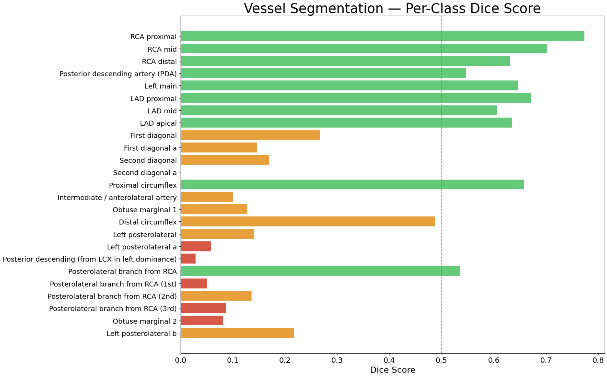
</p>

<p align="center">
  <em>Per-class Dice score on the validation set. Color indicates performance tier: green (over 0.5), orange (0.1 to 0.5), red (under 0.1).</em>
</p>

| Metric | Value |
|---|---:|
| Pixel accuracy (incl. background) | 0.980 |
| Foreground-only accuracy | 0.564 - 0.596 |
| **Mean Dice** (25 classes) | **0.427 - 0.447** |
| **Mean F1** (25 classes) | **0.441 - 0.459** |
| Mean IoU (25 classes) | 0.321 - 0.333 |
| Classes with Dice greater than 0.5 | 10-11 / 25 |
| Classes with Dice less than 0.1 | 6-8 / 25 |

<p align="center">
  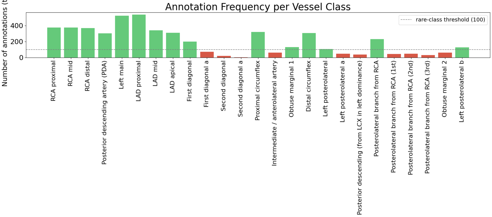
</p>

<p align="center">
  <em>Training-set annotation frequency per class. Model performance correlates strongly with annotation count -- classes below the 100-annotation threshold (red) are the same ones with the lowest Dice scores above.</em>
</p>

<p align="center">
  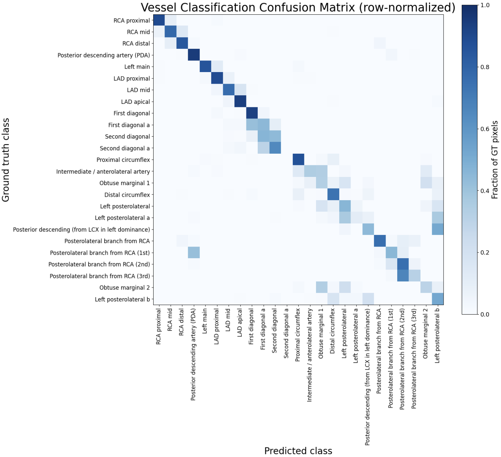
</p>

<p align="center">
  <em>Row-normalized confusion matrix. Off-diagonal mass concentrates between anatomically adjacent segments (e.g. diagonal branches, RCA posterolateral variants), consistent with the per-class Dice pattern above.</em>
</p>

## Stenosis Detection (YOLOv8n-seg)

| Metric | Box | Mask |
|---|---:|---:|
| Precision | 0.465 | 0.498 |
| Recall | 0.335 | 0.411 |
| **F1** | 0.389 | **0.449** |
| mAP50 | 0.332 | 0.405 |

## Comparison with the Official ARCADE (MICCAI 2023) Leaderboard

<p align="center">
  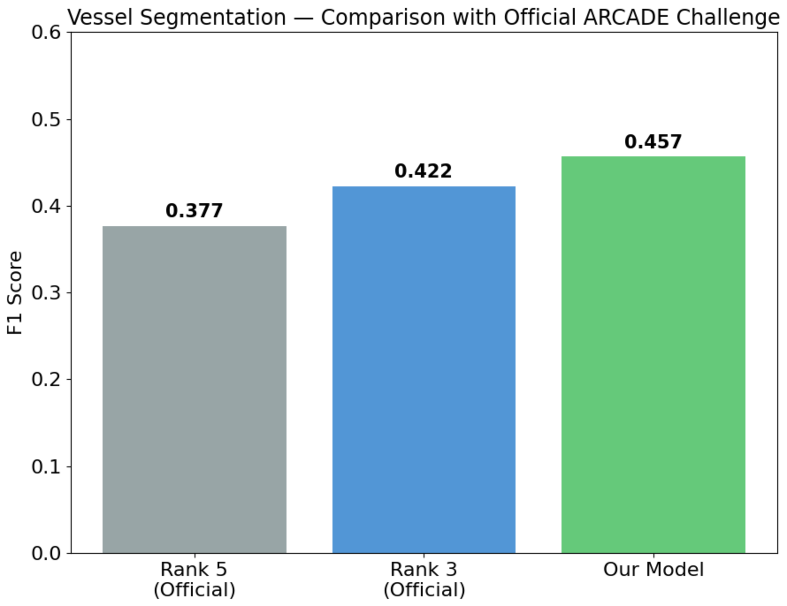
</p>

<p align="center">
  <em>Vessel-segmentation Mean F1 (0.457) exceeds the official challenge's 3rd-place result (0.422, YOLO-Angio) and 5th-place result (0.377, ensemble learning) -- with a single, non-ensembled U-Net.</em>
</p>

Stenosis-detection Mask F1 (0.449) sits between the official 4th- and 3rd-place results (0.394 / 0.535).

---

# Combined Pipeline & Severity Index

Both models run on the same input image; predictions are merged into one figure with a shared color legend, then passed through a **SYNTAX-inspired severity index**: each detected stenosis is assigned to its nearest vessel segment, and the official SYNTAX segment-weighting factor for that segment is summed across all detected lesions.

> This is explicitly **not** a clinical-grade SYNTAX score. Percent diameter narrowing, lesion length, calcification, tortuosity, and bifurcation involvement are not available in the ARCADE annotations and are not modeled -- see [`src/severity_index.py`](src/severity_index.py) for exactly what is and isn't captured.

<p align="center">
  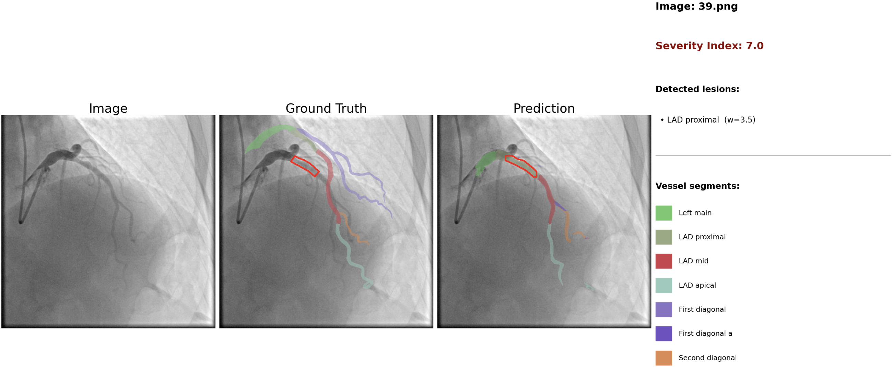
</p>

<p align="center">
  <em>A single lesion on LAD proximal (SYNTAX weight 3.5) leads to Severity Index 7.0.</em>
</p>

<p align="center">
  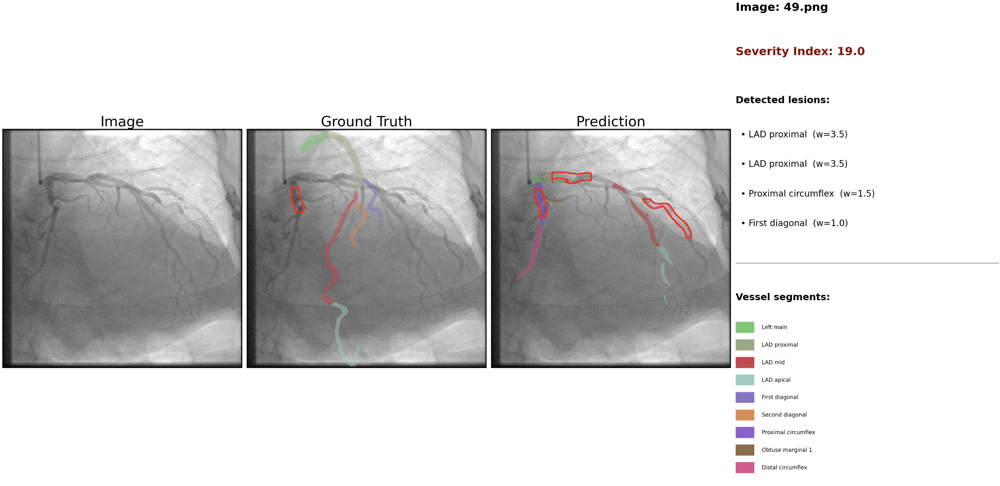
</p>

<p align="center">
  <em>Three detected lesions across LAD proximal (x2) and proximal circumflex lead to Severity Index 19.0.</em>
</p>

<p align="center">
  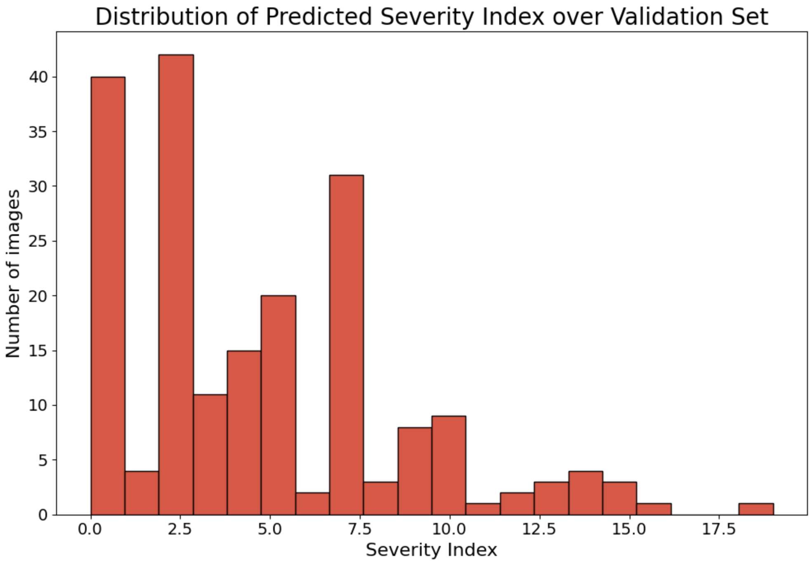
</p>

<p align="center">
  <em>Distribution of the predicted severity index across the validation set. Most images fall in the 0-10 range, consistent with the dataset averaging about 1.6 stenosis lesions per image.</em>
</p>

---

# Visualization

Three dedicated figure types are generated per image, each with a fixed, stable color per vessel class so that the same segment always renders identically across every figure.

## Vessel Only

<p align="center">
  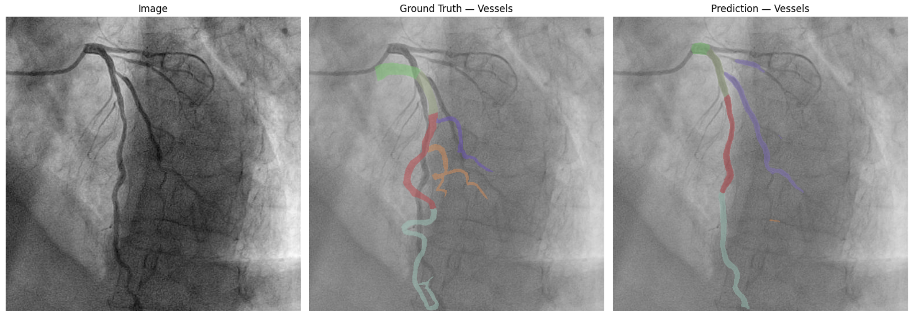
</p>

## Stenosis Only

<p align="center">
  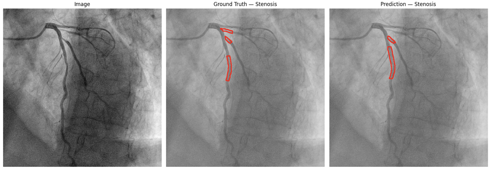
</p>

## Combined

<p align="center">
  
</p>

<p align="center">
  <em>Both tasks overlaid with a shared, non-overlapping legend panel.</em>
</p>

---

# Architecture Decisions

This project went through two distinct architectures, and the reasoning is documented here rather than discarded, since it reflects the actual research process:

1. **First attempt -- a single multi-task network** (shared ResNet-34 encoder, two decoder heads). This collapsed for stenosis for the pixel-imbalance reasons above: every loss-balancing scheme tried either predicted nothing or produced extreme false positives, and about 48% of stenosis instances lie outside any annotated vessel in the same image, ruling out crop-based localization as a fix.

2. **Final architecture -- two independent, specialized models.** Vessel segmentation stayed a dense per-pixel U-Net (vessels are large, contiguous, and well-annotated). Stenosis moved to a detection-style model (YOLOv8-seg), sidestepping the pixel-imbalance problem by framing the task as instance localization -- consistent with the official ARCADE leaderboard, where detection-style methods dominate the top ranks.

Also fixed along the way: ARCADE's `syntax` annotations map `category_id` to the true SYNTAX segment number through the `name` field, **not** through `id` itself (e.g. `category_id=20` maps to `name="16"`). See [`data/coco_utils.py`](data/coco_utils.py) and [`data/README.md`](data/README.md) for the full finding.

---

# Limitations

- **Rare vessel classes are effectively unlearned.** 11 of 25 classes have fewer than 100 training annotations; class-weighted loss and rare-class oversampling helped (Dice below 0.1 classes reduced from 11 to 6-8) but did not solve this.
- A **copy-paste augmentation** experiment for rare classes was tried and made results *worse* (Mean F1 0.459 to 0.430) -- left undone and documented here as a negative result.
- **Ground truth is manually annotated (CVAT)** with known inter-rater variability per the official challenge documentation; some prediction errors likely reflect label ambiguity rather than pure model failure.
- **The severity index is a simplified approximation**, not a validated clinical score.
- **Stenosis recall is incomplete** -- on validation images with multiple ground-truth lesions, the model frequently detects only a subset, understating the true severity index.

---

# Installation

Clone the repository:

```bash
git clone https://github.com/SarvinChitsaz/Angio-DualDx.git
cd Angio-DualDx
```

Install the required packages:

```bash
pip install -r requirements.txt
```

---

# Requirements

The project was developed using:

```text
Python >= 3.10
PyTorch
segmentation-models-pytorch
ultralytics (YOLOv8)
Albumentations
OpenCV
NumPy / SciPy
Matplotlib
Pillow
```

CUDA / Apple MPS is automatically used when available.

---

# Running the Project

```bash
export ARCADE_BASE_DIR=./data/raw/arcade/arcade   # see data/README.md for download

python main.py --stage train-vessel     # train the U-Net vessel model
python main.py --stage train-stenosis   # fine-tune YOLOv8n-seg for stenosis
python main.py --stage eval             # full validation metrics for both models
python main.py --stage demo --image path/to/angiogram.png
```

The default hyperparameters can be modified in [`configs/config.py`](configs/config.py) before running.

---

# Future Work

- Semi-supervised pseudo-labeling for the stenosis model (the top-performing published ARCADE method uses this and reaches F1 of about 0.536)
- nnU-Net-style automatic preprocessing configuration for the vessel model
- K-fold cross-validation for more robust reported metrics given the small (1000-image) training set
- Ensembling across multiple seeds for both models
- A validated, clinically-reviewed severity scoring extension

---

# License

This project is released under the MIT License.

See the [LICENSE](LICENSE) file for additional details.
